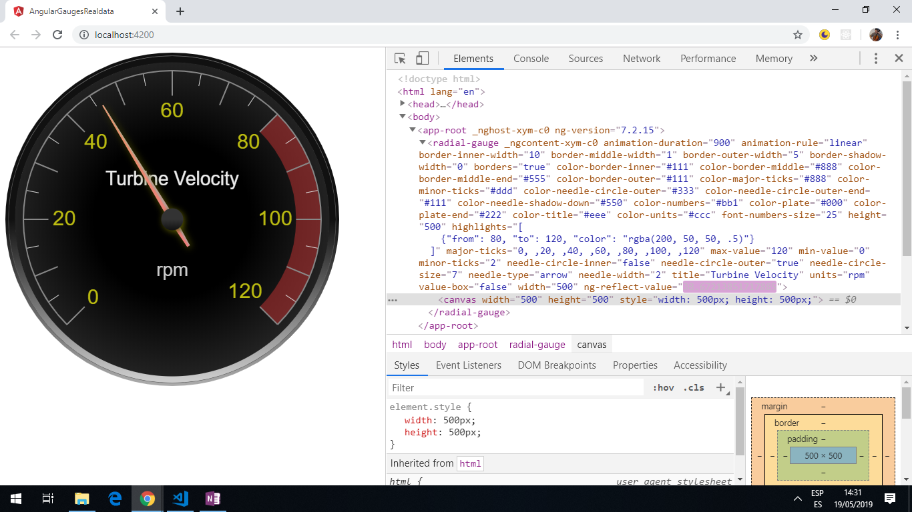

# :zap: Angular Gauges Real Data

* App to display real data using an Angular component wrapper [ng-canvas-gauges](https://www.npmjs.com/package/ng-canvas-gauges) for the open-source Javascript [canvas-gauges](https://canvas-gauges.com/) library.

*** Note: to open web links in a new window use: _ctrl+click on link_**

## :page_facing_up: Table of contents

* [General info](#general-info)
* [Screenshots](#screenshots)
* [Technologies](#technologies)
* [Setup](#setup)
* [Features](#features)
* [Status](#status)
* [Inspiration](#inspiration)
* [Contact](#contact)

## :books: General info

* Data displayed on an analogue gauge. A random number function is used to simulate real-time data.

## :camera: Screenshots



## :signal_strength: Technologies

* [Angular framework v10](https://angular.io/)
* [ng-canvas-gauges v6](https://www.npmjs.com/package/ng-canvas-gauges)

## :floppy_disk: Setup

Install dependencies with `npm i` then run `ng serve` for a dev server. Navigate to `http://localhost:4200/`. The app will automatically reload if you change any of the source files.

## :computer: Code Examples

* app.component.html - extract - defines some of the qualities of the analogue gauge

```html
<radial-gauge
  [value]="(value$ | async)"
  title="Turbine Velocity"
  units="rpm"
  width="500"
  height="500"

  min-value="0"
  max-value="120"
  major-ticks="0, ,20, ,40, ,60, ,80, ,100, ,120"
  minor-ticks="2"
  font-numbers-size="25"
```

## :cool: Features

* [Canvas Gauges website](https://canvas-gauges.com/) includes extensive [User Documentation](https://canvas-gauges.com/documentation/user-guide/).

## :clipboard: Status & To-Do List

* Status: Not working - error message:

`app.component.html:1 ERROR TypeError: Cannot read property update of undefined
    at RadialGauge$$1.push../node_modules/ng-canvas-gauges/fesm5/ng-canvas-gauges.js.BaseGauge.basicUpdate (ng-canvas-gauges.js:347).

* Once fixed, will be app that displays a gauge, configurable from `app.component.html`.
* To-Do: Fix. Add functionality and extend to include connection to an API.

## :clap: Inspiration

* [Post by Wayne Parrott: Add A Realtime Gauge To Your Angular Project](http://www.wayneparrott.com/add-a-realtime-gauge-to-your-angular-project/)

## :envelope: Contact

* Repo created by [ABateman](https://www.andrewbateman.org) - you are welcome to [send me a message](https://andrewbateman.org/contact)
