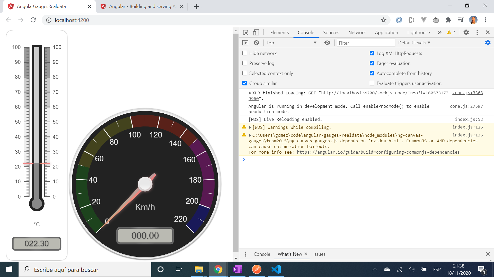

# :zap: Angular Gauges Real Data

* App to display data using an Angular component wrapper [ng-canvas-gauges](https://www.npmjs.com/package/ng-canvas-gauges) for the open-source Javascript [canvas-gauges](https://canvas-gauges.com/) library. Don't update.
* **Note:** to open web links in a new window use: _ctrl+click on link_


## :page_facing_up: Table of contents

* [:zap: Angular Gauges Realdata](#zap-angular-gauges-realdata)
  * [:page_facing_up: Table of contents](#page_facing_up-table-of-contents)
  * [:books: General info](#books-general-info)
  * [:camera: Screenshots](#camera-screenshots)
  * [:signal_strength: Technologies](#signal_strength-technologies)
  * [:floppy_disk: Setup](#floppy_disk-setup)
  * [:computer: Code Examples](#computer-code-examples)
  * [:cool: Features](#cool-features)
  * [:clipboard: Status & To-Do List](#clipboard-status--to-do-list)
  * [:clap: Inspiration](#clap-inspiration)
  * [:file_folder: License](#file_folder-license)
  * [:envelope: Contact](#envelope-contact)

## :books: General info

* Data displayed on analogue gauges - examples from [CANVAS GAUGES USER GUIDE](https://canvas-gauges.com/documentation/user-guide/)

## :camera: Screenshots



## :signal_strength: Technologies

* [Angular framework v13](https://angular.io/)
* [ng-canvas-gauges v6](https://www.npmjs.com/package/ng-canvas-gauges). Published 3 years ago.

## :floppy_disk: Setup

* Install dependencies with `npm i`
* Run `ng serve` for a dev server.
* Navigate to `http://localhost:4200/`. The app will automatically reload if you change any of the source files.

## :computer: Code Examples

* app.component.html - extract - defines some of the qualities of the analogue gauge

```html
<radial-gauge
  [value]="(value$ | async)"
  title="Turbine Velocity"
  units="rpm"
  width="500"
  height="500"

  min-value="0"
  max-value="120"
  major-ticks="0, ,20, ,40, ,60, ,80, ,100, ,120"
  minor-ticks="2"
  font-numbers-size="25"
```

## :cool: Features

* [Canvas Gauges website](https://canvas-gauges.com/) includes extensive [User Documentation](https://canvas-gauges.com/documentation/user-guide/).

## :clipboard: Status & To-Do List

* Status: Working
* To-Do: Nothing

## :clap: Inspiration

* [Post by Wayne Parrott: Add A Realtime Gauge To Your Angular Project](http://www.wayneparrott.com/add-a-realtime-gauge-to-your-angular-project/)
* [CANVAS GAUGES USER GUIDE](https://canvas-gauges.com/documentation/user-guide/)

## :file_folder: License

* This project is licensed under the terms of the MIT license.

## :envelope: Contact

* Repo created by [ABateman](https://github.com/AndrewJBateman), email: gomezbateman@yahoo.com
